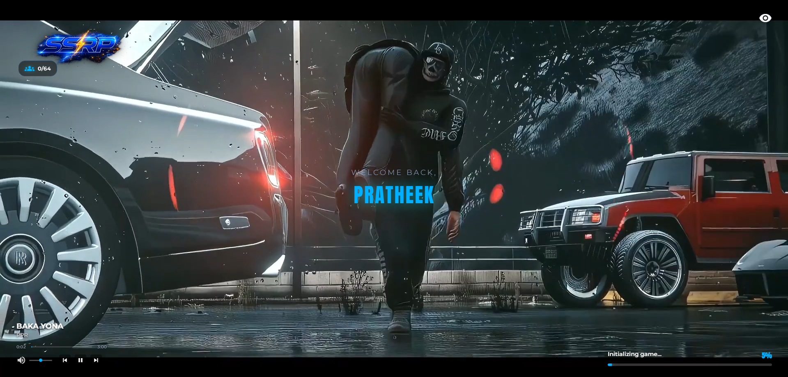

# 🎮 Premium FiveM Loading Screen

A modern, highly customizable loading screen for FiveM servers featuring a sleek, glassmorphic UI, dynamic media controls, and seamless server integration.



---

## ✨ Features

- **🎬 Fullscreen Video Background**: Supports `.mov`, `.mp4`, and `.webm` video formats to set the perfect mood for your server.
- **👁️ Cinema Mode Toggle**: Let players hide the UI by clicking the visibility toggle button in the top-right corner to enjoy the background video in full screen.
- **👋 Dynamic Welcoming**: 
  - Welcomes new players with a server introduction: `Welcome to [Server Name], [Player Name]`.
  - Greets returning players with a cozy: `Welcome back, [Player Name]`.
  - Automatically fades out the welcome card after 7 seconds.
- **👥 Live Player Count**: Displays the current online players (e.g. `12/64 Online`) using native FiveM deferrals handover data.
- **🎵 Advanced Music Player**:
  - Interactive playlist supporting multiple custom MP3 tracks.
  - Controls: Play/Pause, Next Track, Previous Track.
  - Interactive Progress Bar: Shows time elapsed, total duration, and allows clicking/dragging on the progress bar to seek.
  - Volume Slider: Smooth volume controls.
  - State Persistence: Remembers the player's volume and playback preferences (saves to browser `localStorage` for future logins).
- **⏳ Progressive Loading Bar**: A glowing neon-blue progress bar displaying realistic initialization stages (`0%` to `100%`) alongside status text like *Initializing game...*, *Loading world data...*, etc.

---

## 🚀 Installation

1. Download or clone this repository.
2. Place the folder `Fivem-Loading-screen` inside your server's `resources` directory.
3. Add the resource to your `server.cfg` file:
   ```cfg
   ensure Fivem-Loading-screen
   ```
4. Restart your server or type `ensure Fivem-Loading-screen` in the server console.

---

## ⚙️ Configuration

You can easily customize all aspects of the loading screen via the **`config.lua`** file.

### Customization Options

```lua
Config = {}

-- Server Logo
Config.ShowLogo = true              -- Set to false to hide the logo
Config.Logo = "assets/ssrp.webp"    -- Path to your server logo image

-- Fullscreen Background Video
Config.Video = "assets/loading-video.mov" -- Path to the background video file

-- Music Player Configuration
Config.EnableMusic = true           -- Toggle the music player UI and playback
Config.Music = {
    { title = "BAKA YONA", artist = "PPR", src = "assets/BAKA_YONA.mp3" },
    -- Add more songs below using the same format:
    -- { title = "Song Title", artist = "Artist Name", src = "assets/song.mp3" },
}

-- Welcomes & Player Counts
Config.ShowWelcome = true           -- Toggle the greeting card
Config.ShowPlayerCount = true       -- Toggle the online players badge
```

---

## 📂 File Structure

```bash
Fivem-Loading-screen/
├── assets/                     # Media files (Images, Videos, Music)
│   ├── BAKA_YONA.mp3
│   ├── loading-video.mov
│   └── ssrp.webp
├── html/                       # Front-end UI files
│   ├── config.json             # Merged client-side configuration
│   ├── index.html              # Main HTML markup structure
│   ├── script.js               # Logic, media player, & browser fallback testing
│   └── styles.css              # Cyberpunk glassmorphic stylesheet
├── config.lua                  # Server-side configuration file
├── fxmanifest.lua              # Resource manifest file
├── server.lua                  # Server-side playerConnecting handler
├── how_it_looks.png            # Showcase image
└── README.md                   # Documentation
```

---

## 🛠️ Testing Locally

You can test the UI and logic locally inside a normal web browser. 
1. Open the directory in your code editor.
2. Start a local HTTP server from the root directory (e.g. `npx http-server` or VS Code Live Server).
3. Open `http://localhost:8000/html/index.html` in your browser.
4. **Browser Testing Mode**: When loaded outside FiveM, a built-in simulation script automatically executes a fake loading progress from `0%` to `100%`, allowing you to inspect the layout, test controls, and preview the design in real-time.

---

## 📝 Credits

- **Author**: `ppr-dev`
- **Design & Coding**: [Pratheek Scripts](https://github.com/)

---
Enjoy the loading screen! If you encounter any issues or have suggestions, feel free to open a pull request or submit an issue.
